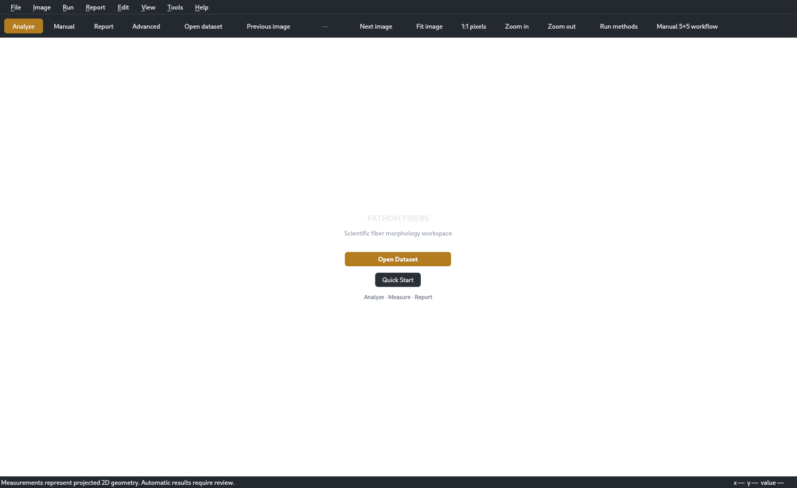
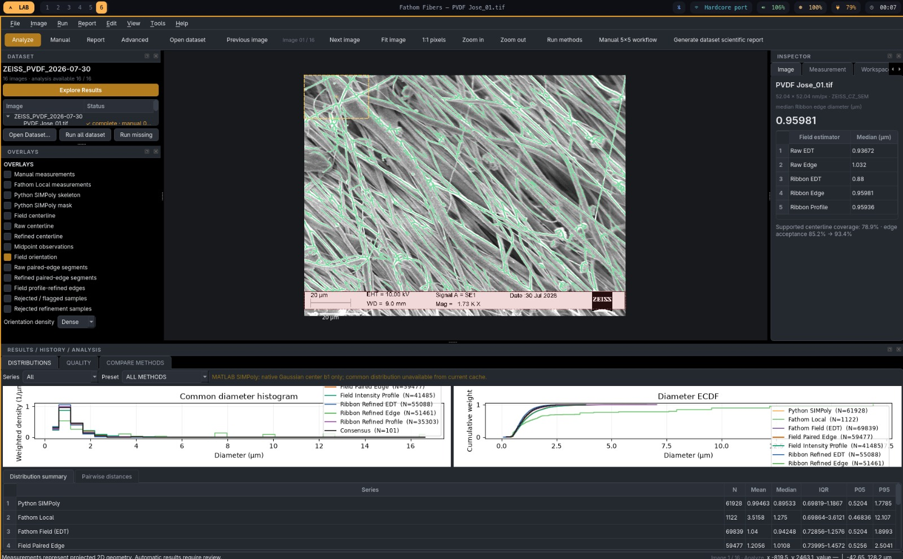

# Fathom Fibers

**Scientific desktop workspace and headless Python engine for calibrated projected 2D fiber morphology analysis in SEM images.**

[](https://github.com/kegouro/fathom-fibers/releases)
[](https://github.com/kegouro/fathom-fibers/actions/workflows/release-build.yml)
[](https://www.python.org/)
[](LICENSE)

Fathom Fibers combines a reviewable **PySide6 desktop application** with a **Qt-free scientific core**. It reads calibrated microscopy images, supports manual and assisted measurements, compares multiple estimators on common units, and exports reproducible reports with provenance.

> **Scientific status.** Measurements represent **projected 2D geometry**. Automatic measurements enter as `PROPOSED` and are excluded from primary statistics until reviewed. Python SIMPoly is a source-compatible approximation with known library divergences; Fathom Field and Oriented Ribbon V1 are experimental. Manual 5×5 is a sparse human reference and Consensus is a pseudo-reference — neither is claimed as ground truth.



<sub>Real Fathom Fibers UI, captured from the release build with deterministic synthetic calibrated data. No private SEM data are embedded in the repository.</sub>

## Download

**v0.2.0-rc1** ships as portable native desktop builds. No Python installation is required.

| Platform | Architecture | Package |
|---|---:|---|
| Linux | x86_64 | [FathomFibers-0.2.0-rc1-linux-x86_64.tar.gz](https://github.com/kegouro/fathom-fibers/releases/download/v0.2.0-rc1/FathomFibers-0.2.0-rc1-linux-x86_64.tar.gz) |
| Windows | x86_64 / AMD64 | [FathomFibers-0.2.0-rc1-windows-amd64.zip](https://github.com/kegouro/fathom-fibers/releases/download/v0.2.0-rc1/FathomFibers-0.2.0-rc1-windows-amd64.zip) |
| macOS | Apple Silicon (arm64) | [FathomFibers-0.2.0-rc1-macos-arm64.tar.gz](https://github.com/kegouro/fathom-fibers/releases/download/v0.2.0-rc1/FathomFibers-0.2.0-rc1-macos-arm64.tar.gz) |
| macOS | Intel (x86_64) | [FathomFibers-0.2.0-rc1-macos-x86_64.tar.gz](https://github.com/kegouro/fathom-fibers/releases/download/v0.2.0-rc1/FathomFibers-0.2.0-rc1-macos-x86_64.tar.gz) |

Each archive is published with a matching `.sha256` sidecar. See the [release page](https://github.com/kegouro/fathom-fibers/releases/tag/v0.2.0-rc1) for notes and checksums.

After extracting the archive, launch the bundled `FathomFibers` executable (`FathomFibers.exe` on Windows).

## What it does

- **Calibrated microscopy input** — Zeiss SEM TIFF metadata, anisotropic pixel calibration, valid-image-body/footer handling and explicit physical units.
- **Scientific desktop workspace** — dataset navigation, per-image result cache, background method execution, progress reporting and reviewable overlays.
- **Manual metrology** — projected width, distance, polyline/tortuosity, angle, rectangle/polygon ROI and intensity profile tools.
- **Manual 5×5 reference protocol** — 25 targets per image with immediate autosave and resumable progress.
- **Method comparison** — common units/bins, weighted diameter distributions, ECDFs, Wasserstein-1, KS and median-difference summaries.
- **Multiple estimators** — Python SIMPoly, Fathom Local, Fathom Field estimator variants and experimental Oriented Ribbon V1 infrastructure.
- **Reproducible output** — image-level and dataset-level HTML reports, CSV/JSON exports, figures, source hashes and provenance.
- **Headless use** — the same scientific engine is available without Qt and is exposed to the desktop app and SPMKit adapter.

## Screenshots

### Scientific workspace


### Fiber measurement session



A live measurement session in the workspace: calibrated SEM image with measurement overlays and per-estimator diameter results.

### Built-in Quick Start


The `workspace.png` and `quick-start.png` screenshots are deliberately based on synthetic data so they can be regenerated without the private validation corpus.

## Start from source

```bash
git clone https://github.com/kegouro/fathom-fibers.git
cd fathom-fibers
python -m venv .venv
source .venv/bin/activate          # Windows: .venv\Scripts\activate
python -m pip install -e ".[gui]"
fathom-fibers
```

For development and validation tools:

```bash
python -m pip install -e ".[gui,dev,validation]"
OMP_NUM_THREADS=1 QT_QPA_PLATFORM=offscreen python -m pytest -q
python -m ruff check .
```

On Arch Linux, install Python and common OpenGL runtime libraries first if required:

```bash
sudo pacman -S --needed python base-devel libglvnd
```

## Desktop workflow

1. **Open a dataset** — choose the folder containing the SEM TIFF images. The dataset dock tracks cached/uncached analysis and manual progress per image.
2. **Analyze** — run missing methods for the dataset or selected methods for the current image. Results are cached; normal navigation does not rerun algorithms.
3. **Inspect distributions** — compare weighted histograms and ECDFs on identical units and bins, then inspect pairwise W1 / KS / median differences.
4. **Review overlays and measurements** — inspect masks, centerlines, edges, rejected samples and individual measurement records.
5. **Complete Manual 5×5 when required** — draw one perpendicular projected-width measurement at each target; every accepted measurement autosaves immediately.
6. **Report** — generate the image or dataset scientific report and export the complete analysis bundle.

The built-in Help dialog mirrors this workflow and documents the keyboard shortcuts.

## Methods and scientific status

| Method / reference | Role | Status |
|---|---|---|
| MATLAB SIMPoly cache | External validated reference implementation | Optional validation adapter; never launched by the normal workspace |
| Python SIMPoly | Source-compatible Python estimator | Validated approximation; exact MATLAB parity is **not** claimed |
| Fathom Local | Local cross-section estimator | Implemented |
| Fathom Field | EDT / paired-edge / intensity-profile estimator family | **Experimental** |
| Oriented Ribbon V1 | Refined-centerline / local re-measurement approach | **Experimental** |
| Manual 5×5 | Sparse human measurement protocol | Human reference, not absolute ground truth |
| Consensus | Equal-method median quantile pseudo-reference | Pseudo-reference only |

For unified comparisons, native estimands remain visible and the common comparison estimand is `COMMON_LENGTH_WEIGHTED_DIAMETER`. Agreement on real SEM images should be interpreted as **method agreement/behavior**, not proof of absolute accuracy.

See [SIMPoly validation profile](docs/validation/simpoly-source-profile.md), [measurement workflow](docs/measurement-workflow.md) and [architecture](docs/architecture.md) for the exact caveats and contracts.

## Headless Python API

```python
from fathom_fibers_quick.api import FathomEngine

engine = FathomEngine()
image = engine.open_image("micrograph.tif")

line = engine.measure(
    image,
    "PROJECTED_WIDTH",
    {"p1": (120.0, 80.0), "p2": (120.0, 112.0)},
)

fathom = engine.run_fathom(image, roi_bbox=(100, 60, 500, 460))
simpoly, intermediates = engine.run_simpoly(
    image,
    profile="SIMPOLY_CONTROLLED_INPUT_V1",
    roi_bbox=(100, 60, 500, 460),
)
comparison = engine.compare_methods(image, roi_bbox=(100, 60, 500, 460))
unified = engine.compare_all_methods(image)
```

Arrays are supported without filesystem access; calibration remains explicit. See [docs/api.md](docs/api.md) for the complete API contracts.

## CLI

```bash
fathom-fibers                         # open the Qt workspace
fathom-fibers gui [image-or-project]
fathom-fibers inspect --hash image.tif
fathom-fibers inventory images/ -o inventory.csv
fathom-fibers benchmark

fathom-fibers methods list
fathom-fibers compare --image image.tif --matlab-cache-root /path/to/cache

fathom-fibers campaign inventory
fathom-fibers campaign run --methods matlab-simpoly,python-simpoly,fathom --resume
fathom-fibers campaign report
fathom-fibers campaign unified --dataset /path/to/tiffs --matlab-cache-root /path/to/cache
fathom-fibers campaign unified-report
```

MATLAB and the private TIFF corpus are optional validation adapters. The normal test suite does not require either. Licensed MATLAB tests are opt-in:

```bash
FATHOM_MATLAB_EXECUTABLE=/path/to/matlab pytest -m matlab
```

The frozen and source application both expose an offscreen-safe smoke test:

```bash
QT_QPA_PLATFORM=offscreen fathom-fibers gui --smoke-test
```

## Architecture

```text
PySide6 UI
   │
   ▼
WorkspaceController
   │
   ├── workspace / cache / reports
   ├── ProjectSession
   └── FathomEngine  ──► scientific algorithms + method contracts
                            │
                            ├── headless CLI / Python API
                            └── SPMKit adapter
```

The scientific core does **not** import PySide6. UI widgets delegate domain work through the controller/session layers, which keeps scientific logic testable headlessly and makes alternative frontends possible.

The legacy Tk application remains at `fathom_fibers_quick.app` for migration safety; the default entry point launches the PySide6 workspace.

## Releases

Native release builds are produced on GitHub-hosted runners for:

- Ubuntu / Linux x86_64
- Windows x86_64
- macOS Apple Silicon (arm64)
- macOS Intel (x86_64)

A `v*` tag runs the full source gates, builds each platform natively with PyInstaller, runs release verification, uploads checksums and publishes a GitHub Release. Release artifacts embed source commit/build provenance.

The release process intentionally performs **no cross-compilation**: Windows and macOS packages are built on their native runners.

## Reproducibility and scope

Fathom preserves calibration, source hashes, geometry, protocol snapshots, uncertainty fields, repeatability metadata, review status, autosave history and atomic project persistence where applicable.

The source-compatible SIMPoly port retains the source algorithm order and literal decisions, but R2026a probes do **not** justify claiming exact parity for every dependency-level operation. In particular, CLAHE, Canny, complex thickening, skeletonization, automatic histogram binning and nonlinear fitting must be interpreted according to the validation profile.

Current limitations are documented explicitly in [STATUS.md](STATUS.md). The project does not claim production readiness, universal fiber-instance reconstruction, or known absolute accuracy on real SEM data.

## License

MIT. See [LICENSE](LICENSE).
