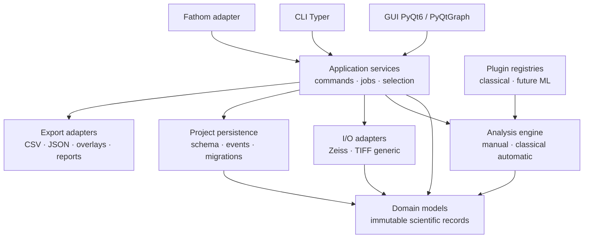

# Fathom Fibers — Plan Maestro de Arquitectura y Desarrollo

**Estado:** diseño maestro inicial  
**Fecha base:** 2026-08-04  
**Nombre de trabajo del repositorio:** `fathom-fibers`  
**Paquete Python:** `fathom_fibers`  
**Aplicación/CLI:** `fathom-fibers`  
**Autor del proyecto:** José Labarca Baeza  
**Ecosistema objetivo:** Pharos Project · SPMKit · Fathom

---

## 0. Decisión ejecutiva

Se construirá **un repositorio separado**, ejecutable como aplicación independiente y diseñado desde el principio para integrarse como módulo externo de Fathom.

No será:

- un script de segmentación aislado;
- una subcarpeta experimental dentro de `spmkit`;
- una interfaz acoplada a un único algoritmo;
- una caja negra de IA;
- una herramienta que confunda segmentos visibles con fibras físicas completas.

Sí será:

- una aplicación de escritorio local;
- un motor científico headless;
- una herramienta manual, asistida y automática;
- Zeiss-first, pero con lectores generalizables;
- trazable, reproducible y editable;
- extensible por entry points;
- integrable posteriormente con Fathom sin reescribir el motor;
- preparada para modelos ligeros de visión o ML futuros, sin depender de ellos ahora.

### Objetivo de producto v1.0

Abrir micrografías SEM, especialmente TIFF Zeiss del SEM de la USM, y permitir:

1. leer automáticamente calibración y metadatos;
2. definir el área válida de análisis;
3. medir diámetros manualmente cuando el usuario no confíe en el automático;
4. segmentar y separar tramos de fibras automáticamente;
5. estimar diámetros locales y estadísticos por fibra o segmento;
6. contar entidades con semántica explícita;
7. identificar poblaciones de tamaño;
8. detectar candidatos a defectos;
9. seleccionar cualquier fibra o medición desde la imagen, tabla o histograma;
10. corregir, dividir, unir, aceptar, rechazar y auditar resultados;
11. guardar el proyecto completo y reproducirlo;
12. exportar tablas, figuras y un informe científicamente defendible.

---

# 1. Principios arquitectónicos no negociables

## 1.1 Separación por capas

La interfaz gráfica no contendrá algoritmos científicos. Los algoritmos no importarán Qt.



Reglas:

- `domain/` no importa GUI, CLI, Fathom ni modelos ML.
- `analysis/` solo depende de `domain/`, NumPy/SciPy y dependencias científicas explícitas.
- `application/` orquesta; no implementa matemáticas.
- `gui/` no calcula resultados científicos.
- `integrations/fathom.py` es un adaptador, no el núcleo.
- cualquier backend futuro entrega **propuestas estandarizadas**, no modifica el proyecto directamente.

## 1.2 Manual-first, no manual-only

La medición manual es una capacidad científica central:

- referencia para validar el automático;
- solución cuando la imagen es ambigua;
- método para crear ground truth;
- herramienta para medir imágenes fuera del dominio del algoritmo;
- forma de cuantificar variabilidad entre operadores.

El desarrollo comienza por manual y asistido porque fija correctamente:

- geometría;
- calibración;
- modelo de datos;
- experiencia de usuario;
- persistencia;
- provenance;
- criterios de validación.

Después se añade automatización sobre esa base.

## 1.3 Zeiss-first, general por contratos

La primera implementación optimiza el flujo real del SEM Zeiss EVO de la USM.

Los TIFF de muestra contienen la etiqueta propietaria `CZ_SEM` y campos como:

- `ap_image_pixel_size`;
- `ap_width`;
- `ap_height`;
- `ap_mag`;
- `ap_actualkv`;
- `ap_wd`;
- `dp_detector_channel`;
- fecha, hora, instrumento y operador.

El lector Zeiss conocerá esos campos. El resto del motor solo recibirá una imagen calibrada genérica.

No se usará OCR como fuente principal cuando existe metadata estructurada. La barra visual se usa para verificación y fallback.

## 1.4 Resultados honestos

El producto distinguirá:

- **ancho proyectado local**;
- **diámetro asumido**, cuando se acepta el modelo geométrico;
- **segmento visible**;
- **trayectoria reconstruida**;
- **fibra confirmada manualmente**;
- **candidato a defecto**;
- **defecto confirmado por el operador**.

Nunca mostrará “N fibras” sin especificar qué se contó.

## 1.5 El ML propone; el motor científico mide

Un futuro modelo de visión podrá proponer:

- máscara;
- instancias;
- ejes;
- cruces;
- regiones defectuosas;
- puntuaciones de confianza.

No podrá decidir por sí solo:

- la calibración física;
- la fórmula de diámetro;
- la estadística final;
- la exclusión silenciosa de datos;
- la identidad científica definitiva de una fibra;
- la modificación irreversible del proyecto.

El resultado final siempre pasará por el mismo motor determinista de geometría, medición, QC y provenance.

---

# 2. Alcance y exclusiones

## 2.1 Alcance v1.0

### Entrada

- TIFF Zeiss con `CZ_SEM`;
- TIFF genérico;
- PNG/JPEG/BMP como fallback, con calibración manual;
- una imagen individual;
- carpeta o lote de imágenes;
- proyecto previamente guardado.

### Modos

- Manual;
- Asistido;
- Automático clásico;
- Revisión;
- Validación ciega;
- Batch.

### Salidas

- mediciones locales;
- resumen por segmento;
- resumen por trayectoria;
- resumen por imagen;
- resumen por muestra/lote;
- poblaciones de tamaño;
- orientación;
- cobertura proyectada;
- densidad de longitud;
- cruces;
- candidatos a defectos;
- tablas y figuras;
- archivo de proyecto reproducible.

## 2.2 Fuera de v1.0

- reconstrucción 3D de redes;
- inferencia universal de fibras ocultas bajo múltiples cruces;
- afirmación de diámetro real para cualquier geometría;
- IA generativa;
- entrenamiento integrado de grandes redes;
- ejecución remota o cloud;
- colaboración multiusuario en tiempo real;
- base de datos institucional;
- soporte universal de todos los SEM;
- clasificación química o material desde intensidad SEM;
- porosidad volumétrica 3D.

---

# 3. Terminología científica canónica

## 3.1 Entidades

### `DiameterSample`

Una sección transversal local con dos bordes y una distancia física.

### `FiberSegment`

Tramo visible entre extremos, cruces, discontinuidades o regiones excluidas.

### `FiberTrack`

Trayectoria compuesta por uno o más segmentos conectados. Puede ser:

- automática;
- reconstruida;
- confirmada;
- parcialmente confirmada.

### `FiberInstance`

Término de interfaz reservado para una entidad que el usuario acepta como una fibra individual. No debe asignarse automáticamente con confianza baja.

### `Junction`

Cruce, unión o región topológica con más de dos ramas.

### `DefectCandidate`

Región señalada por reglas o modelo, pendiente de revisión.

## 3.2 Estados de revisión

```text
UNREVIEWED
AUTO_ACCEPTED
MANUAL_CONFIRMED
MANUAL_EDITED
REJECTED
AMBIGUOUS
NOT_MEASURABLE
```

## 3.3 Fuentes de medición

```text
MANUAL_FREE_CALIPER
MANUAL_ORTHOGONAL
ASSISTED_EDGE_SNAP
ASSISTED_TRACE
AUTO_NORMAL_EDGE
AUTO_DISTANCE_TRANSFORM
IMPORTED_REFERENCE
```

## 3.4 Semántica de conteo

El panel siempre separará:

```text
Visible segments
Reconstructed tracks
Manually confirmed fibers
Edge-censored tracks
Ambiguous components
```

---

# 4. Estructura completa del repositorio

```text
fathom-fibers/
├── .github/
│   ├── ISSUE_TEMPLATE/
│   ├── pull_request_template.md
│   └── workflows/
│       ├── ci-core.yml
│       ├── ci-gui.yml
│       ├── docs.yml
│       ├── package.yml
│       └── validation-smoke.yml
│
├── docs/
│   ├── index.md
│   ├── architecture.md
│   ├── scientific-scope.md
│   ├── measurement-theory.md
│   ├── zeiss-tiff.md
│   ├── user-manual.md
│   ├── validation.md
│   ├── plugin-api.md
│   ├── model-provider-api.md
│   ├── project-format.md
│   ├── known-limitations.md
│   └── adr/
│       ├── 0001-separate-repository.md
│       ├── 0002-manual-first.md
│       ├── 0003-zeiss-first-general-contracts.md
│       ├── 0004-coordinate-conventions.md
│       ├── 0005-ml-produces-proposals.md
│       ├── 0006-event-history.md
│       ├── 0007-spmkit-tiff-routing-gap.md
│       ├── 0008-classical-default-backend.md
│       └── 0009-counting-semantics.md
│
├── src/fathom_fibers/
│   ├── __init__.py
│   ├── api.py
│   ├── version.py
│   ├── errors.py
│   │
│   ├── domain/
│   │   ├── __init__.py
│   │   ├── image.py
│   │   ├── calibration.py
│   │   ├── coordinates.py
│   │   ├── geometry.py
│   │   ├── measurement.py
│   │   ├── fiber.py
│   │   ├── defects.py
│   │   ├── populations.py
│   │   ├── quality.py
│   │   ├── provenance.py
│   │   ├── results.py
│   │   └── recipe.py
│   │
│   ├── io/
│   │   ├── __init__.py
│   │   ├── contracts.py
│   │   ├── registry.py
│   │   ├── probe.py
│   │   ├── zeiss_sem_tiff.py
│   │   ├── generic_tiff.py
│   │   ├── raster_image.py
│   │   ├── scale_bar.py
│   │   └── footer.py
│   │
│   ├── analysis/
│   │   ├── __init__.py
│   │   ├── pipeline.py
│   │   ├── manual/
│   │   │   ├── caliper.py
│   │   │   ├── orthogonal.py
│   │   │   ├── trace.py
│   │   │   └── sampling.py
│   │   ├── preprocessing/
│   │   │   ├── grayscale.py
│   │   │   ├── normalization.py
│   │   │   ├── background.py
│   │   │   ├── denoise.py
│   │   │   └── ridge.py
│   │   ├── segmentation/
│   │   │   ├── contracts.py
│   │   │   ├── classical.py
│   │   │   ├── threshold.py
│   │   │   ├── morphology.py
│   │   │   └── proposals.py
│   │   ├── topology/
│   │   │   ├── skeleton.py
│   │   │   ├── graph.py
│   │   │   ├── junctions.py
│   │   │   ├── pruning.py
│   │   │   └── tracking.py
│   │   ├── diameter/
│   │   │   ├── contracts.py
│   │   │   ├── normal_profile.py
│   │   │   ├── edge_subpixel.py
│   │   │   ├── distance_transform.py
│   │   │   ├── filtering.py
│   │   │   └── summaries.py
│   │   ├── populations/
│   │   │   ├── manual_bins.py
│   │   │   ├── mixture.py
│   │   │   ├── bootstrap.py
│   │   │   └── stability.py
│   │   ├── defects/
│   │   │   ├── beads.py
│   │   │   ├── constrictions.py
│   │   │   ├── fused_regions.py
│   │   │   ├── debris.py
│   │   │   ├── film_regions.py
│   │   │   └── review.py
│   │   ├── uncertainty/
│   │   │   ├── calibration.py
│   │   │   ├── localization.py
│   │   │   ├── sensitivity.py
│   │   │   └── hierarchical.py
│   │   └── quality/
│   │       ├── resolution.py
│   │       ├── blur.py
│   │       ├── saturation.py
│   │       ├── contrast.py
│   │       └── gates.py
│   │
│   ├── application/
│   │   ├── __init__.py
│   │   ├── state.py
│   │   ├── commands.py
│   │   ├── events.py
│   │   ├── reducer.py
│   │   ├── services.py
│   │   ├── jobs.py
│   │   ├── cancellation.py
│   │   ├── progress.py
│   │   ├── selection.py
│   │   └── linked_views.py
│   │
│   ├── project/
│   │   ├── __init__.py
│   │   ├── manifest.py
│   │   ├── archive.py
│   │   ├── schema.py
│   │   ├── migrations.py
│   │   ├── autosave.py
│   │   ├── hashing.py
│   │   └── recovery.py
│   │
│   ├── plugins/
│   │   ├── __init__.py
│   │   ├── contracts.py
│   │   ├── manifests.py
│   │   ├── registry.py
│   │   ├── discovery.py
│   │   ├── builtins.py
│   │   └── model_providers.py
│   │
│   ├── export/
│   │   ├── __init__.py
│   │   ├── measurements_csv.py
│   │   ├── fibers_csv.py
│   │   ├── defects_csv.py
│   │   ├── summary_json.py
│   │   ├── overlay_image.py
│   │   ├── report_html.py
│   │   └── bundle.py
│   │
│   ├── gui/
│   │   ├── __init__.py
│   │   ├── app.py
│   │   ├── main_window.py
│   │   ├── actions.py
│   │   ├── shortcuts.py
│   │   ├── resources.py
│   │   ├── viewmodels/
│   │   │   ├── workspace.py
│   │   │   ├── image.py
│   │   │   ├── tools.py
│   │   │   ├── inspector.py
│   │   │   ├── statistics.py
│   │   │   ├── pipeline.py
│   │   │   └── history.py
│   │   ├── panels/
│   │   │   ├── navigator.py
│   │   │   ├── canvas.py
│   │   │   ├── pipeline.py
│   │   │   ├── inspector.py
│   │   │   ├── statistics.py
│   │   │   ├── review_queue.py
│   │   │   └── history.py
│   │   ├── canvas/
│   │   │   ├── scene.py
│   │   │   ├── transform.py
│   │   │   ├── layers.py
│   │   │   ├── hit_testing.py
│   │   │   ├── items/
│   │   │   │   ├── caliper.py
│   │   │   │   ├── fiber_path.py
│   │   │   │   ├── diameter_sample.py
│   │   │   │   ├── defect.py
│   │   │   │   └── selection.py
│   │   │   └── tools/
│   │   │       ├── base.py
│   │   │       ├── pan_zoom.py
│   │   │       ├── free_caliper.py
│   │   │       ├── orthogonal_caliper.py
│   │   │       ├── trace_fiber.py
│   │   │       ├── add_section.py
│   │   │       ├── split_track.py
│   │   │       ├── merge_tracks.py
│   │   │       ├── exclude_region.py
│   │   │       └── review_defect.py
│   │   ├── dialogs/
│   │   │   ├── calibration.py
│   │   │   ├── import_image.py
│   │   │   ├── recipe.py
│   │   │   ├── export.py
│   │   │   └── recovery.py
│   │   └── widgets/
│   │       ├── measurement_table.py
│   │       ├── fiber_table.py
│   │       ├── linked_histogram.py
│   │       ├── orientation_plot.py
│   │       ├── quality_badges.py
│   │       └── profile_plot.py
│   │
│   ├── cli/
│   │   ├── __init__.py
│   │   ├── app.py
│   │   ├── inspect.py
│   │   ├── analyze.py
│   │   ├── export.py
│   │   ├── batch.py
│   │   ├── validate.py
│   │   └── plugins.py
│   │
│   ├── integrations/
│   │   ├── __init__.py
│   │   ├── fathom_module.py
│   │   ├── fathom_panels.py
│   │   ├── fathom_session.py
│   │   └── spmkit_adapter.py
│   │
│   └── resources/
│       ├── defaults/
│       │   ├── zeiss_usm.yaml
│       │   ├── sem_nonwoven.yaml
│       │   └── manual_validation.yaml
│       ├── schemas/
│       │   ├── project-v1.schema.json
│       │   ├── recipe-v1.schema.json
│       │   └── model-manifest-v1.schema.json
│       └── icons/
│
├── tests/
│   ├── architecture/
│   ├── domain/
│   ├── io/
│   ├── analysis/
│   ├── application/
│   ├── project/
│   ├── plugins/
│   ├── export/
│   ├── gui/
│   ├── cli/
│   └── fixtures/
│
├── validation/
│   ├── README.md
│   ├── protocols/
│   ├── phantoms/
│   ├── frozen_oracles/
│   ├── campaigns/
│   └── reports/
│
├── examples/
│   ├── recipes/
│   ├── scripts/
│   └── synthetic/
│
├── scripts/
│   ├── inspect_zeiss_tags.py
│   ├── make_synthetic_fibers.py
│   ├── freeze_reference_measurements.py
│   └── build_validation_report.py
│
├── CHANGELOG.md
├── CITATION.cff
├── CONTRIBUTING.md
├── LICENSE
├── README.md
├── SECURITY.md
├── pyproject.toml
└── uv.lock
```

---

# 5. Modelo de datos

Todos los objetos científicos principales serán dataclasses congeladas o estructuras inmutables equivalentes.

## 5.1 Imagen calibrada

```python
@dataclass(frozen=True)
class MicroscopyImage2D:
    image_id: str
    intensity: np.ndarray
    display_rgb: np.ndarray | None
    calibration: Calibration2D
    valid_mask: np.ndarray
    source: SourceArtifact
    modality: str
    instrument: InstrumentMetadata | None
    acquisition: Mapping[str, object]
```

### Reglas

- `intensity` es la matriz usada por análisis.
- `display_rgb` conserva el raster original si contiene overlays o color.
- la imagen original nunca se modifica;
- `valid_mask=False` excluye footer y regiones no analizables;
- las unidades internas son SI;
- no se guardan valores físicos en “nm” o “µm” dentro de algoritmos;
- la unidad de presentación se elige en GUI/exportación.

## 5.2 Calibración

```python
@dataclass(frozen=True)
class Calibration2D:
    pixel_size_x_m: float
    pixel_size_y_m: float
    source: CalibrationSource
    uncertainty_x_m: float | None
    uncertainty_y_m: float | None
    confidence: float
    evidence: tuple[CalibrationEvidence, ...]
```

Fuentes:

```text
ZEISS_METADATA
FIELD_WIDTH_METADATA
SCALE_BAR_MANUAL
SCALE_BAR_DETECTED
USER_ENTERED
IMPORTED_PROJECT
```

## 5.3 Coordenadas

Convención única:

- `x`: columna, aumenta hacia la derecha;
- `y`: fila, aumenta hacia abajo;
- origen: centro del píxel superior izquierdo;
- las coordenadas de entidades pueden ser subpíxel;
- la distancia física usa las dos escalas por separado;
- la orientación científica se calcula en el plano físico y se reporta módulo 180°.

```python
def physical_distance(a, b, calibration):
    dx = (b.x - a.x) * calibration.pixel_size_x_m
    dy = (b.y - a.y) * calibration.pixel_size_y_m
    return hypot(dx, dy)
```

No se asumirá que los píxeles son cuadrados.

## 5.4 Muestra local de diámetro

```python
@dataclass(frozen=True)
class DiameterSample:
    sample_id: str
    fiber_id: str | None
    segment_id: str | None
    center_px: Point2D
    edge_a_px: Point2D
    edge_b_px: Point2D
    tangent_image_rad: float | None
    width_m: float
    width_px_equivalent: float
    method: DiameterMethod
    status: ReviewStatus
    uncertainty_m: float | None
    confidence: MeasurementConfidence
    quality_flags: frozenset[QualityFlag]
    provenance: ProvenanceRecord
```

## 5.5 Segmento y trayectoria

```python
@dataclass(frozen=True)
class FiberSegment:
    segment_id: str
    centerline_px: np.ndarray
    diameter_sample_ids: tuple[str, ...]
    endpoint_kinds: tuple[EndpointKind, EndpointKind]
    status: ReviewStatus
    quality_flags: frozenset[QualityFlag]
```

```python
@dataclass(frozen=True)
class FiberTrack:
    fiber_id: str
    segment_ids: tuple[str, ...]
    reconstruction_confidence: float
    status: ReviewStatus
    population_id: str | None
    notes: str
```

## 5.6 Resumen por fibra

```python
@dataclass(frozen=True)
class FiberStatistics:
    n_samples_total: int
    n_samples_valid: int
    mean_width_m: float
    median_width_m: float
    std_width_m: float
    iqr_width_m: float
    cv_width: float
    raw_min_width_m: float
    raw_max_width_m: float
    p05_width_m: float
    p95_width_m: float
    visible_length_m: float
    tortuosity: float | None
    mean_orientation_deg: float | None
```

La interfaz mostrará min/mediana/max, pero el informe destacará P05/P95 como extremos robustos.

---

# 6. Lector Zeiss SEM

## 6.1 Contrato de lector propio

```python
@runtime_checkable
class ImageReader(Protocol):
    reader_id: str
    extensions: tuple[str, ...]

    def probe(self, path: Path) -> ProbeResult: ...
    def inspect(self, path: Path) -> ImageInspection: ...
    def load(self, path: Path, options: LoadOptions) -> MicroscopyImage2D: ...
```

`probe()` no se limita a la extensión. Devuelve:

```python
@dataclass(frozen=True)
class ProbeResult:
    confidence: float
    format_id: str | None
    reasons: tuple[str, ...]
    requires_full_read: bool = False
```

## 6.2 Detección Zeiss

Criterio principal:

- TIFF válido;
- tag `CZ_SEM` presente;
- estructura parseable;
- campos mínimos de imagen disponibles.

El tag observado en las muestras es `34118`, pero el código debe localizarlo por nombre y conservar compatibilidad si tifffile cambia su representación.

## 6.3 Campos mínimos

Obligatorios o fuertemente esperados:

```text
ap_image_pixel_size
ap_width
ap_height
ap_mag
ap_actualkv
ap_wd
dp_detector_channel
dp_sem
ap_date
ap_time
sv_serial_number
sv_version
```

## 6.4 Verificación de calibración

Se comparan:

```text
pixel_size × ImageWidth  vs  ap_width
pixel_size × ImageHeight vs  ap_height
```

Política inicial:

- diferencia ≤1 %: aceptar;
- >1 % y ≤5 %: advertir y conservar evidencia;
- >5 %: exigir confirmación;
- metadata ausente: calibración manual;
- valores no físicos o cero: rechazar la calibración.

Los umbrales serán configurables y validados con el instrumento real.

## 6.5 Footer del SEM

El footer se trata como máscara, no como crop destructivo.

Detección por:

1. perfil Zeiss conocido;
2. discontinuidad horizontal persistente;
3. alta densidad de texto/zonas blancas;
4. confirmación visual del usuario;
5. ajuste manual si falla.

El proyecto guarda:

- máscara propuesta;
- decisión del usuario;
- versión del detector;
- coordenadas exactas.

## 6.6 TIFF genérico

Fallback:

- carga intensidad;
- detecta si RGB es realmente grayscale replicado;
- busca metadata TIFF estándar;
- solicita calibración;
- permite dibujar una barra de escala;
- permite indicar longitud y unidad;
- guarda la incertidumbre del usuario.

---

# 7. Herramientas manuales

## 7.1 Caliper libre

Flujo:

1. clic en borde A;
2. clic en borde B;
3. vista previa en vivo;
4. confirmación;
5. asignación opcional a una fibra;
6. inclusión o exclusión estadística.

Capacidades:

- arrastrar extremos;
- mover la sección completa;
- duplicar;
- eliminar;
- añadir nota;
- marcar como dudosa;
- convertir a caliper ortogonal.

## 7.2 Caliper ortogonal asistido

El usuario selecciona el centro de la fibra. El sistema estima la tangente local mediante un método clásico ligero:

- estructura tensorial;
- respuesta de ridge;
- orientación de gradiente;
- ajuste local del eje.

Luego construye la normal y propone dos bordes.

La GUI muestra:

- perfil transversal;
- gradiente;
- bordes propuestos;
- ancho;
- desviación angular;
- confianza.

Los extremos siempre son arrastrables.

## 7.3 Trazado manual de fibra

El usuario dibuja una polilínea sobre el eje de la fibra.

El motor:

1. suaviza sin cambiar los puntos originales;
2. parametriza por longitud de arco;
3. calcula tangentes y normales;
4. propone secciones equiespaciadas;
5. excluye cruces indicados;
6. permite añadir o borrar secciones;
7. genera resumen por fibra.

El proyecto conserva:

- puntos originales;
- curva interpolada;
- método de suavizado;
- espaciado;
- secciones aceptadas;
- ediciones posteriores.

## 7.4 Protocolo de muestreo

Opciones:

- `fixed_count`: N secciones;
- `fixed_spacing`: una sección cada X µm;
- `manual_only`;
- `clean_regions_only`;
- `adaptive_curvature`;
- `exclude_junction_guard`.

Default v0.1:

```yaml
manual_sampling:
  mode: fixed_count
  count: 5
  minimum_spacing_px: 10
  exclude_edge_touch: true
```

## 7.5 Validación ciega

Modo especial:

- oculta resultados automáticos;
- presenta regiones aleatorias;
- bloquea el acceso al valor previo;
- registra operador y repetición;
- permite segundo operador;
- revela comparación al terminar.

Salidas:

- sesgo;
- MAE;
- diferencia relativa;
- Bland–Altman;
- variabilidad intraoperador;
- variabilidad interoperador.

---

# 8. Pipeline automático clásico

## 8.1 Flujo general


## 8.2 Quality gates iniciales

Se calculan antes de segmentar:

- resolución física;
- estimación de ancho en píxeles;
- blur;
- saturación;
- contraste;
- cobertura válida;
- footer;
- bordes;
- artefactos evidentes.

Una región con fibras demasiado finas puede servir para orientación o cobertura, pero no para diámetro. El sistema debe poder emitir:

```text
DIAMETER_NOT_RESOLVED
ORIENTATION_ONLY
GLOBAL_NETWORK_METRICS_ONLY
```

## 8.3 Preprocesamiento

Separar siempre:

- transformaciones de **visualización**;
- transformaciones de **análisis**.

Cambiar brillo visual no altera resultados.

Pipeline configurable:

```yaml
preprocessing:
  grayscale: luminance
  invert: auto
  background:
    method: rolling_percentile
    radius_um: 8
  denoise:
    method: gaussian
    sigma_px: 0.8
  contrast:
    method: none
```

No usar CLAHE por defecto en la medición científica. Puede estar disponible para visualización o como rama explícita de robustez.

## 8.4 Segmentación clásica

Backend inicial:

```text
multiscale ridge response
+ local/adaptive threshold
+ morphology in physical units
+ connected-component QC
```

Salida:

```python
@dataclass(frozen=True)
class SegmentationProposal:
    mask: np.ndarray
    score_map: np.ndarray | None
    excluded_mask: np.ndarray
    regions: tuple[RegionRecord, ...]
    config_hash: str
    backend_id: str
    provenance: ProvenanceRecord
```

La score map clásica no se presentará como probabilidad calibrada a menos que exista calibración formal.

## 8.5 Topología

Se obtendrá un esqueleto y un grafo:

- nodos terminales;
- nodos de paso;
- junctions;
- segmentos;
- componentes;
- guard zones alrededor de cruces;
- spurs;
- bucles.

No se medirá diámetro dentro de la guard zone de junctions salvo intervención manual.

## 8.6 Reconstrucción de trayectorias

El emparejamiento de ramas usa:

- continuidad angular;
- similitud de ancho;
- proximidad;
- intensidad;
- curvatura;
- penalización por salto;
- evidencia del usuario.

Salida:

- pares propuestos;
- score separado por criterio;
- alternativa siguiente;
- estado ambiguo.

Nunca se oculta la ambigüedad.

## 8.7 Medición automática principal

Método principal:

```text
centerline tangent
→ normal physical direction
→ sample intensity/mask profile
→ locate both edges subpixel
→ compute physical width
→ QC
```

Fallback:

```text
2 × distance transform on pruned medial axis
```

El fallback se usa como:

- referencia;
- control de consistencia;
- método para regiones simples;
- diagnóstico de divergencia.

## 8.8 Filtrado de muestras

Excluir o marcar:

- junction guard;
- borde de imagen;
- regiones fusionadas;
- perfil sin dos bordes;
- baja respuesta;
- saturación;
- ancho menor al límite de resolución;
- curvatura extrema;
- normal fuera de máscara;
- múltiples cruces del perfil;
- inconsistencia fuerte entre estimadores.

## 8.9 Muestreo decorrelacionado

No usar cada píxel del eje como observación independiente.

La distancia entre secciones se define por:

- mínimo físico;
- ancho local;
- autocorrelación estimada;
- densidad máxima configurable.

Se conserva la serie completa para visualización, pero la inferencia estadística usa muestras decorrelacionadas o jerárquicas.

---

# 9. Poblaciones de tamaño

## 9.1 Modo de umbrales definidos

El usuario puede establecer:

```yaml
population_bins:
  - id: fine
    upper_um: 1.0
  - id: medium
    lower_um: 1.0
    upper_um: 3.0
  - id: coarse
    lower_um: 3.0
```

## 9.2 Modo inferido

Procedimiento:

1. una observación principal por segmento/fibra;
2. usar la mediana del ancho;
3. transformar `log(width)`;
4. ajustar 1…K componentes;
5. seleccionar por BIC;
6. fijar semilla;
7. bootstrap por imagen y fibra;
8. evaluar estabilidad;
9. asignar probabilidades;
10. marcar asignaciones ambiguas.

La interfaz dirá “poblaciones compatibles con los datos”, no “tipos de fibra demostrados”.

## 9.3 Vistas estadísticas

- histograma;
- KDE opcional;
- ECDF;
- violin/box por imagen;
- mixture components;
- probabilidad de asignación;
- comparación entre muestras;
- sensibilidad al número de componentes.

---

# 10. Defectos clásicos

Todos comienzan como candidatos.

## 10.1 Beads

Criterios combinables:

- ratio respecto de baseline local;
- prominencia;
- longitud mínima;
- conectividad con una fibra;
- área extra;
- forma;
- persistencia multiescala.

## 10.2 Constricciones

- caída local de ancho;
- persistencia;
- no confundir con blur o borde;
- resolución suficiente.

## 10.3 Fusión

- región ancha conectando ejes;
- múltiples centerlines;
- perfiles con múltiples bordes;
- inconsistencia topológica.

## 10.4 Film-like

- componente extensa;
- baja elongación;
- cobertura local;
- ausencia de eje estable;
- textura compatible.

## 10.5 Debris/partículas

- componente no explicada por fibra;
- forma compacta;
- no conectada a centerline;
- tamaño físico.

## 10.6 Estados de revisión

```text
CANDIDATE
CONFIRMED
REJECTED
UNCERTAIN
NOT_APPLICABLE
```

---

# 11. Incertidumbre y confianza

## 11.1 No usar una confianza monolítica

```python
@dataclass(frozen=True)
class MeasurementConfidence:
    calibration: float
    resolution: float
    edge_localization: float
    segmentation: float | None
    topology: float | None
    review: float
```

La GUI puede resumir, pero el archivo guarda dimensiones separadas.

## 11.2 Componentes de incertidumbre

- calibración;
- selección manual de borde;
- localización subpíxel;
- orientación del caliper;
- variación de segmentación;
- variación longitudinal;
- variación entre imágenes;
- variación entre operadores.

## 11.3 Sensibilidad

El sistema puede ejecutar pequeñas perturbaciones:

- umbral;
- sigma;
- escala de ridge;
- radio morfológico;
- posición de borde;
- guard zone;
- criterio de tracking.

Resultado:

- distribución de salida;
- estabilidad de clasificación;
- fibras sensibles;
- regiones frágiles.

---

# 12. Interfaz de usuario

## 12.1 Layout

```text
┌────────────────────────────────────────────────────────────────────────────┐
│ Archivo · Proyecto · Herramientas · Análisis · Validación · Exportar       │
├───────────────┬──────────────────────────────────────┬─────────────────────┤
│ NAVEGADOR     │                                      │ INSPECTOR           │
│ imágenes      │              CANVAS                  │ selección actual    │
│ ROIs          │                                      │ mediciones          │
│ capas         │ original + overlays interactivos     │ QC                  │
│ filtros       │                                      │ provenance          │
├───────────────┼──────────────────────────────────────┼─────────────────────┤
│ PIPELINE      │ ESTADÍSTICAS / PERFIL / HISTOGRAMA   │ COLA DE REVISIÓN    │
│ etapas        │ linked brushing                      │ dudosas/defectos     │
└───────────────┴──────────────────────────────────────┴─────────────────────┘
```

## 12.2 Capas

- imagen original;
- imagen de análisis;
- valid mask;
- ROI;
- score map;
- máscara;
- centerlines;
- junction guards;
- segmentos;
- trayectorias;
- secciones;
- poblaciones;
- defectos;
- confianza;
- exclusiones;
- correcciones manuales.

## 12.3 Linked brushing

Selección sincronizada entre:

- imagen;
- tabla de fibras;
- tabla de mediciones;
- histograma;
- gráfico de orientación;
- perfil transversal;
- cola de defectos.

## 12.4 Selección de fibra

Al seleccionar:

- las demás se atenúan;
- la seleccionada se contornea;
- aparecen min, mediana y max;
- opcionalmente aparecen todas las secciones;
- se muestra el perfil local;
- el histograma resalta su bin;
- la tabla hace scroll;
- se muestran flags y provenance.

## 12.5 Colores

- color principal: grupo/población;
- ámbar Pharos: selección activa;
- gris: ambiguo/no revisado;
- rojo reservado: error o QC crítico;
- patrón/contorno además de color;
- paleta apta para daltonismo;
- colores persistentes por ID.

No asignar cientos de colores saturados simultáneos por fibra.

## 12.6 Herramientas y atajos

```text
V          seleccionar
H/Space    pan
Z          zoom
M          caliper libre
O          caliper ortogonal
T          trazar fibra
A          añadir sección
X          excluir región
S          dividir
J          unir
R          revisar/aceptar
Delete     eliminar selección
Ctrl+Z     deshacer
Ctrl+Shift+Z rehacer
Ctrl+S     guardar
Ctrl+E     exportar
```

## 12.7 Rendimiento

- `ImageItem` con orden row-major;
- overlays vectoriales por lotes;
- simplificación visual por nivel de zoom;
- no dibujar miles de handles hasta seleccionar;
- análisis en worker;
- cancelación;
- progreso por etapa;
- caché por imagen+receta;
- arrays `float32`, `uint8` y `bool` cuando corresponda;
- no duplicar RGB sin necesidad.

---

# 13. Estado, historial y comandos

## 13.1 Estado inmutable

```python
@dataclass(frozen=True)
class ProjectState:
    revision: int
    image: MicroscopyImage2D
    analysis_regions: tuple[AnalysisRegion, ...]
    measurements: Mapping[str, DiameterSample]
    segments: Mapping[str, FiberSegment]
    tracks: Mapping[str, FiberTrack]
    defects: Mapping[str, DefectCandidate]
    selection: SelectionState
    recipe: FiberRecipe
    provenance: ProjectProvenance
```

## 13.2 Comandos

Ejemplos:

```text
SetCalibration
ConfirmFooterMask
AddFreeCaliper
MoveCaliperEndpoint
DeleteMeasurement
CreateFiberTrack
AssignMeasurementToFiber
TraceFiber
AddDiameterSection
SplitSegment
MergeTracks
AcceptAutomaticProposal
RejectAutomaticProposal
SetPopulation
ConfirmDefect
ExcludeRegion
RunAnalysis
ChangeRecipe
```

## 13.3 Eventos

Cada comando validado produce eventos append-only:

```text
CalibrationSet
FooterMaskConfirmed
MeasurementAdded
MeasurementMoved
MeasurementDeleted
TrackCreated
TrackSplit
TrackMerged
ProposalAccepted
DefectConfirmed
AnalysisCompleted
```

## 13.4 Undo/redo

- cada comando conoce su inversa o el reducer puede reconstruir;
- no se modifica directamente el objeto;
- undo/redo forma parte del historial;
- los análisis largos se aplican como transacción.

---

# 14. Formato de proyecto

Extensión:

```text
.fiberproj
```

Contenedor ZIP seguro:

```text
manifest.json
project.json
events.jsonl
arrays/
  valid_mask.npy
  roi_mask.npy
  segmentation_mask.npy
  score_map.npy
  centerlines.npz
previews/
  overview.webp
recipes/
  active.yaml
reports/
  last-summary.json
```

## 14.1 Imagen original

Dos modos:

### Referenciada

- ruta relativa/absoluta;
- SHA256;
- tamaño;
- timestamp informativo;
- no duplica archivos.

### Portable

- embebe la imagen original;
- valida hash;
- produce un proyecto autosuficiente.

## 14.2 Seguridad

- nunca usar pickle;
- validar nombres internos;
- impedir path traversal;
- limitar tamaño descomprimido;
- escritura atómica;
- migraciones explícitas;
- proyecto corrupto no sobrescribe el original.

## 14.3 Autosave

- snapshot periódico;
- sidecar en directorio de datos de usuario;
- escritura temporal + rename;
- recuperación al iniciar;
- conservar última sesión limpia y última no limpia.

---

# 15. Recetas y configuración

Separar:

- `DisplaySettings`: no afecta resultados;
- `FiberRecipe`: sí afecta resultados;
- `WorkspaceSettings`: preferencias de UI.

Ejemplo maestro:

```yaml
schema_version: 1
profile: zeiss_usm_nonwoven

input:
  reader: auto
  preserve_rgb: true
  footer_detection: zeiss_profile
  require_footer_confirmation: true

calibration:
  source_priority:
    - zeiss_metadata
    - field_dimensions
    - manual_scale_bar
  crosscheck_warn_relative: 0.01
  crosscheck_fail_relative: 0.05
  propagate_uncertainty: true

quality:
  minimum_resolved_width_px: 5.0
  preferred_width_px: 10.0
  reject_saturated_profiles: true
  reject_edge_touch: true
  blur_check: true

manual:
  orthogonal_assist: true
  default_sections: 5
  preserve_raw_endpoints: true

preprocessing:
  grayscale: luminance
  invert: auto
  background:
    method: rolling_percentile
    radius_um: 8.0
  denoise:
    method: gaussian
    sigma_px: 0.8

segmentation:
  backend: classical_multiscale_v1
  ridge_scales_um: auto
  threshold:
    method: local
    offset: 0.0
  morphology:
    minimum_component_area_um2: 0.2
    maximum_hole_area_um2: 0.2

topology:
  skeleton: medial_axis
  junction_guard_factor: 1.5
  minimum_segment_length_um: 2.0
  reconstruction:
    enabled: true
    minimum_score: 0.75

diameter:
  primary: normal_edge_subpixel_v1
  fallback: pruned_distance_transform_v1
  sample_spacing:
    mode: relative_to_width
    factor: 1.0
  report_raw_extremes: true
  robust_quantiles: [0.05, 0.95]

populations:
  mode: both
  representative: segment_median
  inferred:
    transform: log
    minimum_components: 1
    maximum_components: 4
    criterion: bic
    bootstrap_replicates: 200
    random_seed: 0

defects:
  report_as_candidates: true
  beads:
    enabled: true
  constrictions:
    enabled: true
  fused_regions:
    enabled: true
  debris:
    enabled: true
  film_regions:
    enabled: true

uncertainty:
  calibration: true
  segmentation_sensitivity: true
  hierarchical_bootstrap: true
  group_by_image: true

export:
  physical_unit: um
  include_local_samples: true
  include_rejected: false
  include_provenance: true
```

Los valores numéricos son iniciales y no se congelan como científicos hasta validarlos.

---

# 16. API pública

```python
from fathom_fibers import (
    inspect_image,
    load_image,
    create_project,
    load_project,
    save_project,
    run_analysis,
    export_project,
)
```

## 16.1 Headless

```python
image = load_image("PVDF Jose_01.tif")
project = create_project(image)
result = run_analysis(project, recipe="zeiss_usm_nonwoven")
export_project(result, "out/")
```

## 16.2 Manual programático

```python
measurement = add_manual_caliper(
    project,
    edge_a_px=(100.5, 220.2),
    edge_b_px=(131.8, 218.9),
    fiber_id="F-001",
)
```

## 16.3 CLI

```text
fathom-fibers inspect image.tif
fathom-fibers gui image.tif
fathom-fibers analyze image.tif --recipe recipe.yaml --out results/
fathom-fibers batch ./images --recipe recipe.yaml --out batch/
fathom-fibers project validate sample.fiberproj
fathom-fibers plugins list
fathom-fibers models list
```

---

# 17. Entry points y extensibilidad

## 17.1 Grupos propios

### Plugins ligeros/clásicos

```toml
[project.entry-points."fathom_fibers.plugins.v1"]
mi_plugin = "mi_paquete.plugin:FIBER_PLUGIN"
```

Un plugin puede aportar:

- lectores;
- segmenters;
- diameter estimators;
- population analyzers;
- defect detectors;
- exporters.

### Modelos ML/visión

```toml
[project.entry-points."fathom_fibers.models.v1"]
fiberseg_light = "fiberseg_light.provider:MODEL_PROVIDER"
```

Se separa para no importar frameworks pesados al descubrir plugins normales.

### Integración Fathom

```toml
[project.entry-points."spmkit.gui.modules"]
fibers = "fathom_fibers.integrations.fathom_module:FIBERS_MODULE"
```

## 17.2 Contrato de plugin

```python
@dataclass(frozen=True)
class FiberPlugin:
    plugin_id: str
    api_version: str
    readers: tuple[ImageReader, ...] = ()
    segmenters: tuple[Segmenter, ...] = ()
    diameter_estimators: tuple[DiameterEstimator, ...] = ()
    population_analyzers: tuple[PopulationAnalyzer, ...] = ()
    defect_detectors: tuple[DefectDetector, ...] = ()
    exporters: tuple[Exporter, ...] = ()
```

## 17.3 Contrato de modelo futuro

```python
@runtime_checkable
class ModelProvider(Protocol):
    def manifest(self) -> ModelManifest: ...
    def create(self, options: ModelLoadOptions) -> InferenceBackend: ...
```

```python
@dataclass(frozen=True)
class ModelManifest:
    model_id: str
    version: str
    tasks: tuple[str, ...]
    supported_modalities: tuple[str, ...]
    input_semantics: str
    output_semantics: tuple[str, ...]
    minimum_width_px: float | None
    pixel_size_range_m: tuple[float, float] | None
    preprocessing_id: str
    weights_sha256: str | None
    model_license: str
    code_license: str
    training_data_summary: str
    validation_summary: str
    deterministic: bool
    supported_devices: tuple[str, ...]
```

## 17.4 Salidas normalizadas de ML

```python
@dataclass(frozen=True)
class ProposalBundle:
    segmentation: SegmentationProposal | None
    instances: tuple[InstanceProposal, ...]
    tracks: tuple[TrackProposal, ...]
    defects: tuple[DefectProposal, ...]
    uncertainty_map: np.ndarray | None
    provenance: ProvenanceRecord
```

El backend no devuelve `FiberAnalysisResult`. El pipeline clásico convierte propuestas en mediciones.

## 17.5 Carga perezosa

- descubrir manifest sin cargar pesos;
- importar torch/onnxruntime solo al seleccionar;
- no descargar pesos automáticamente;
- descarga explícita;
- checksum obligatorio;
- cache local versionada;
- error del modelo no tumba la aplicación;
- fallback clásico disponible.

---

# 18. Integración futura con Fathom

## 18.1 Integración inicial segura

La primera integración registra solo `spmkit.gui.modules`.

Paneles:

```text
fibers_canvas       central
fibers_pipeline     left
fibers_inspector    right
fibers_statistics   bottom
fibers_review       right
fibers_history      bottom
```

Perspectiva:

```python
FIBERS_MODULE = ModuleSpec(
    name="fathom_fibers",
    panels=(...),
    perspectives=(
        PerspectiveSpec(
            "fibers",
            "Fibras SEM",
            (
                "fibers_pipeline",
                "fibers_canvas",
                "fibers_inspector",
                "fibers_statistics",
            ),
        ),
    ),
)
```

El ViewModel propio se guarda en:

```python
ctx.store["fathom_fibers.workspace_vm"]
```

## 18.2 Apertura de archivos inicial

Debido a que `.tif` puede pertenecer a JPK o Zeiss y el registry actual de SPMKit selecciona por extensión, la primera integración usará:

```text
Fibras SEM → Abrir TIFF SEM…
```

y el lector propio hará probe por `CZ_SEM`.

No se registra inicialmente el Zeiss reader en `spmkit.plugins.v1`.

## 18.3 Gate de integración global

Antes de enrutar `.tif` globalmente desde Fathom, SPMKit necesita un contrato futuro similar a:

```python
class ReaderV2(Protocol):
    extensions: tuple[str, ...]
    def probe(self, path) -> ProbeResult: ...
    def inspect(self, path) -> DatasetInfo: ...
    def load(self, path, kind=None): ...
```

Y el registry debe elegir por:

1. probe/confidence;
2. magic/tag;
3. prioridad;
4. extensión como filtro inicial, no decisión final.

También conviene permitir kinds extensibles más allá de `image`/`force`.

Esta modificación se plantea como PR separado en SPMKit cuando `fathom-fibers` ya tenga un lector probado.

---

# 19. Dependencias y empaquetado

## 19.1 Dependencias base propuestas

```toml
[project]
requires-python = ">=3.11"
dependencies = [
    "numpy>=1.26",
    "scipy>=1.11",
    "tifffile>=2024.2",
    "pydantic>=2.7",
    "platformdirs>=4.0",
    "typer>=0.12",
    "rich>=13.7",
    "pyyaml>=6.0",
]
```

Los mínimos definitivos se congelan después de la primera matriz CI verde.

## 19.2 Extras

```toml
[project.optional-dependencies]
auto = [
    "scikit-image>=0.24",
    "scikit-learn>=1.5",
]
gui = [
    "fathom-fibers[auto]",
    "PyQt6>=6.6",
    "pyqtgraph>=0.13.7",
    "matplotlib>=3.8",
]
report = [
    "pandas>=2.1",
    "jinja2>=3.1",
]
fathom = [
    "fathom-fibers[gui]",
    "spmkit",
]
dev = [
    "pytest>=8",
    "pytest-cov>=5",
    "pytest-qt>=4.4",
    "hypothesis>=6",
    "ruff>=0.6",
    "mypy>=1.10",
    "pre-commit>=3.7",
    "build",
]
```

No incluir en base:

- PyTorch;
- TensorFlow;
- ONNX Runtime;
- OpenCV;
- CUDA;
- modelos descargables.

Un modelo futuro se distribuye como paquete separado.

## 19.3 Herramientas elegidas

- NumPy: arrays y geometría vectorizada;
- SciPy: interpolación, filtros, transformadas y estadística;
- tifffile: TIFF y tags Zeiss;
- scikit-image: ridge, morfología, skeleton y componentes;
- scikit-learn: poblaciones probabilísticas;
- PyQt6: aplicación;
- PyQtGraph: canvas, overlays, ROI y perfiles interactivos;
- Matplotlib: figuras e informes;
- Pydantic: config y schemas de borde;
- dataclasses congeladas: objetos científicos internos.

## 19.4 Dependencias evitadas inicialmente

### OpenCV

No es necesario para el MVP y agrega otra semántica de imagen, binarios y APIs redundantes.

### NetworkX

El grafo requerido es pequeño y especializado. Se implementará una representación tipada y serializable. Puede reevaluarse si la complejidad crece.

### Pint

Las fronteras científicas usarán SI explícito; la presentación de unidades se mantiene separada y compatible con SPMKit.

---

# 20. Exportación

## 20.1 Archivos

```text
summary.json
image_summary.csv
fibers.csv
segments.csv
diameter_samples.csv
defects.csv
populations.csv
annotated_overview.png
annotated_overview.svg
report.html
recipe.yaml
provenance.json
```

## 20.2 Columnas mínimas de `diameter_samples.csv`

```text
image_id
fiber_id
segment_id
sample_id
method
status
center_x_px
center_y_px
edge_a_x_px
edge_a_y_px
edge_b_x_px
edge_b_y_px
width_px_equivalent
width_m
width_display
display_unit
uncertainty_m
calibration_source
quality_flags
recipe_hash
software_version
```

## 20.3 Agregación

Se reportan tres distribuciones distintas:

- fiber-weighted;
- length-weighted;
- local-sample distribution.

La principal para familias será fiber/segment-weighted, evitando que una fibra larga domine por tener más muestras.

## 20.4 Métricas globales con nombre correcto

- projected background fraction, no porosidad 3D;
- visible fiber length density;
- projected coverage;
- intersection density;
- endpoint density;
- orientation distribution;
- candidate defect density.

---

# 21. Calidad, pruebas y validación

## 21.1 Pirámide de pruebas

### Unitarias

- geometría;
- unidades;
- parser Zeiss;
- calibración;
- stats;
- serialization;
- algoritmos locales.

### Propiedades

- distancia simétrica;
- invariancia por traslación;
- escala física;
- no mutación;
- round-trip de proyecto;
- idempotencia de comandos;
- máscara y ROI.

### Golden files

- metadata congelada de TIFF Zeiss;
- hashes;
- calibración esperada;
- footer esperado;
- exportaciones canónicas.

### Phantoms

- fibras rectas;
- curvas;
- diámetros conocidos;
- píxel anisótropo;
- ruido;
- blur;
- cruces;
- beads;
- fusiones;
- poblaciones múltiples;
- fibras subresueltas.

### GUI

- crear/editar/eliminar caliper;
- undo/redo;
- linked brushing;
- selección;
- guardar/cargar;
- cancelación;
- recuperación.

### Integración

- CLI;
- plugin discovery;
- Fathom module assembly;
- plugin roto aislado;
- proyecto de versión anterior.

## 21.2 Métricas científicas

- error absoluto;
- error relativo;
- sesgo;
- RMSE;
- Bland–Altman;
- cobertura de intervalo;
- error por rango de ancho en píxeles;
- topological precision/recall;
- centerline distance;
- error de conteo por semántica;
- estabilidad de población;
- precisión/recall de defectos;
- acuerdo intra/interoperador.

IoU de máscara no basta.

## 21.3 Objetivos de ingeniería iniciales

Metas, no resultados afirmados:

- parser Zeiss reproducible para las 16 muestras;
- calibración cruzada dentro de 1 % cuando los campos sean coherentes;
- round-trip de mediciones sin pérdida geométrica significativa;
- error <0.5 px en phantoms limpios;
- error relativo <5 % para fibras de ancho ≥10 px;
- junctions excluidas sin contaminar diámetros;
- determinismo con receta y seed fijos;
- cero mediciones físicas si falta calibración;
- cero conteos sin etiqueta semántica.

## 21.4 Datos reales

Antes de publicar las imágenes:

- confirmar permisos;
- no asumir que pueden subirse al repo;
- usar hashes e inventario privado;
- crear crops autorizados o sintéticos;
- eliminar metadata personal si corresponde.

---

# 22. Manejo de errores

Jerarquía tipada:

```text
FiberError
├── InputError
│   ├── UnsupportedFormatError
│   ├── CorruptImageError
│   └── MetadataParseError
├── CalibrationError
│   ├── MissingCalibrationError
│   ├── CalibrationConflictError
│   └── InvalidCalibrationError
├── AnalysisError
│   ├── InsufficientResolutionError
│   ├── SegmentationError
│   ├── TopologyError
│   └── DiameterEstimationError
├── ProjectError
│   ├── ProjectCorruptError
│   ├── SchemaVersionError
│   └── SourceHashMismatchError
└── PluginError
    ├── PluginLoadError
    ├── IncompatiblePluginError
    └── ModelUnavailableError
```

La GUI muestra:

- qué falló;
- qué parte sí se conserva;
- acción recomendada;
- detalles técnicos expandibles;
- ruta al log.

---

# 23. Reproducibilidad y provenance

Cada ejecución guarda:

- SHA256 del archivo;
- lector y versión;
- metadata cruda seleccionada;
- calibración y evidencia;
- máscaras;
- recipe completa;
- recipe hash;
- backend IDs;
- plugin versions;
- seed;
- software version;
- Python/NumPy/SciPy versions;
- sistema operativo;
- timestamp;
- operador;
- ediciones manuales;
- exclusiones;
- flags;
- modelo y weights hash si algún día se usa ML.

Las correcciones manuales nunca se mezclan silenciosamente con resultados automáticos.

---

# 24. Roadmap por batches con gates

## Batch 0 — Fundación

### Entregables

- repo;
- licencia;
- pyproject;
- CI;
- arquitectura;
- ADRs;
- modelos mínimos;
- reglas de imports;
- inventario de las 16 imágenes;
- hash y metadata report.

### Gate

- instalación editable;
- tests de arquitectura;
- ruff/mypy;
- paquete importable;
- no GUI aún.

## Batch 1 — Zeiss I/O y calibración

### Entregables

- `probe`;
- parser `CZ_SEM`;
- inspection;
- load;
- calibration cross-check;
- footer proposal;
- TIFF generic fallback;
- CLI `inspect`.

### Gate

- 16/16 imágenes inspeccionables;
- calibración coherente o conflicto explícito;
- metadata exportable;
- no OCR obligatorio.

## Batch 2 — Proyecto e historial

### Entregables

- `ProjectState`;
- commands/events/reducer;
- `.fiberproj`;
- hash;
- autosave;
- recovery;
- migrations v1.

### Gate

- crear, guardar, cargar;
- source mismatch detectado;
- undo/redo core;
- no pickle;
- escritura atómica.

## Batch 3 — Canvas y caliper manual

### Entregables

- canvas;
- zoom/pan;
- capas;
- caliper libre;
- editar extremos;
- tabla;
- inspector;
- unidad física;
- selección sincronizada.

### Gate

- medición reproducible;
- round-trip de coordenadas;
- undo/redo;
- export CSV;
- GUI no bloqueante.

## Batch 4 — Caliper ortogonal y trazado

### Entregables

- orientación local;
- perfil transversal;
- edge snap;
- trazado manual;
- secciones múltiples;
- stats por fibra;
- min/mediana/max visibles.

### Gate

- el usuario puede completar el encargo sin automatización global;
- toda sección auditable;
- medición manual ciega disponible.

## Batch 5 — QC y exportación científica

### Entregables

- resolución;
- blur;
- saturación;
- flags;
- reports;
- annotated overlay;
- provenance;
- validation protocol manual.

### Gate

- MVP manual `0.1.0`;
- resultados defendibles;
- documentación de limitaciones.

## Batch 6 — Segmentación clásica

### Entregables

- preprocessing;
- ridge;
- threshold;
- morphology;
- proposal map;
- edición de máscara;
- sensibilidad básica.

### Gate

- phantoms;
- casos reales simples;
- regiones dudosas visibles;
- no modificar manuales.

## Batch 7 — Topología y diámetro automático

### Entregables

- skeleton;
- graph;
- junction guards;
- segments;
- normal edge;
- EDT fallback;
- QC;
- review queue.

### Gate

- error por resolución documentado;
- cruces excluidos;
- comparación manual/auto;
- overlay seleccionable.

## Batch 8 — Reconstrucción y conteo

### Entregables

- tracking;
- scores;
- split/merge;
- visible/reconstructed/confirmed counts;
- edge censoring.

### Gate

- ningún conteo ambiguo sin etiqueta;
- tracking editable;
- alternativas guardadas.

## Batch 9 — Poblaciones

### Entregables

- bins manuales;
- GMM log;
- BIC;
- bootstrap;
- linked colors;
- comparación por imagen.

### Gate

- estabilidad visible;
- asignaciones ambiguas;
- no afirmar familias físicas.

## Batch 10 — Defectos clásicos

### Entregables

- beads;
- constrictions;
- fusion;
- debris;
- film;
- review;
- densities.

### Gate

- candidatos, no verdades;
- validación en dataset anotado;
- thresholds explícitos.

## Batch 11 — Batch y Fathom plugin

### Entregables

- análisis de carpeta;
- proyecto por imagen;
- resumen jerárquico;
- `spmkit.gui.modules`;
- perspectiva externa;
- sesión.

### Gate

- app standalone y Fathom comparten el mismo motor;
- no código científico duplicado;
- plugin roto no tumba Fathom.

## Batch 12 — API futura de modelos

### Entregables

- contracts;
- manifest schema;
- discovery;
- mock provider;
- proposal bundle;
- UI para listar proveedores.

### Gate

- sin PyTorch/ONNX en instalación normal;
- mock backend pasa contract tests;
- modelo no puede mutar estado;
- no se implementa todavía un modelo real.

---

# 25. Criterios de versión

## v0.1 — Manual validated workflow

- Zeiss TIFF;
- calibración;
- footer;
- manual;
- trace;
- stats;
- project;
- exports;
- QC básico.

## v0.3 — Assisted workflow

- orientación;
- edge snap;
- perfiles;
- revisión;
- validación ciega.

## v0.6 — Classical automatic beta

- segmentación;
- esqueleto;
- diámetro;
- segmentos;
- review queue.

## v0.8 — Population and defect beta

- poblaciones;
- tracking;
- candidatos a defecto;
- batch.

## v1.0 — Scientifically defensible release

- validación externa;
- manual/auto comparados;
- proyecto estable;
- documentación completa;
- Fathom plugin;
- API pública;
- limitaciones explícitas;
- dataset/protocolo reproducible.

---

# 26. ADRs que deben escribirse antes de implementar

## ADR-0001 — Repositorio separado

**Decisión:** `fathom-fibers` vive fuera de `spmkit`.  
**Razón:** dominio SEM grande y experimental; integración por plugin posterior.

## ADR-0002 — Manual-first

**Decisión:** el MVP manual se completa antes de segmentación global.  
**Razón:** utilidad inmediata y creación de referencia.

## ADR-0003 — Zeiss-first

**Decisión:** soporte excelente para `CZ_SEM`, contrato genérico para otros formatos.  
**Razón:** instrumento real disponible sin bloquear generalización.

## ADR-0004 — Coordenadas

**Decisión:** coordenadas de píxel subpíxel con SI derivado.  
**Razón:** estabilidad de render, persistencia y anisotropía.

## ADR-0005 — ML produce propuestas

**Decisión:** un modelo no produce resultados finales.  
**Razón:** auditabilidad y backend intercambiable.

## ADR-0006 — Event history

**Decisión:** comandos/eventos y snapshots.  
**Razón:** undo/redo, autosave, provenance y comparación.

## ADR-0007 — No registrar `.tif` global inicialmente

**Decisión:** abrir SEM desde el módulo propio.  
**Razón:** conflicto de formatos y routing por extensión en SPMKit actual.

## ADR-0008 — Backend clásico por defecto

**Decisión:** algoritmo determinista, editable y sin pesos.  
**Razón:** instalación simple y ciencia auditable.

## ADR-0009 — Conteos separados

**Decisión:** segmentos, tracks y fibras confirmadas son métricas distintas.  
**Razón:** redes 2D superpuestas son ambiguas.

---

# 27. Primer corte implementable

El primer prompt de implementación debería limitarse a:

1. crear el repo y pyproject;
2. fijar la arquitectura e import rules;
3. implementar `ImageReader`, `ProbeResult` y registry;
4. implementar `ZeissSemTiffReader.inspect`;
5. extraer y normalizar metadata de las 16 imágenes;
6. crear `Calibration2D`;
7. verificar `pixel_size × dimensions`;
8. producir un inventario JSON/CSV;
9. tests;
10. commit y push.

No comenzar todavía:

- GUI;
- segmentación;
- ML;
- defectos;
- clustering;
- Fathom plugin.

El segundo corte:

1. `load`;
2. `MicroscopyImage2D`;
3. valid mask/footer;
4. CLI preview;
5. project skeleton.

El tercer corte:

1. canvas;
2. caliper libre;
3. commands/events;
4. save/load;
5. export.

---

# 28. Definición final del producto

`fathom-fibers` será una herramienta de morfometría de fibras SEM que combina:

- lector instrumental confiable;
- medición manual de alta calidad;
- asistencia geométrica;
- automatización clásica;
- revisión humana;
- estadística jerárquica;
- clasificación probabilística;
- defectos auditables;
- visualización enlazada;
- proyecto reproducible;
- extensibilidad futura.

Su diferenciador no será solamente “detectar fibras”.

Será:

> **poder hacer clic en cualquier resultado, ver exactamente de dónde salió, corregirlo sin destruir el original y exportar una cadena de evidencia completa desde el TIFF hasta la estadística final.**

---

# 29. Veredicto de arquitectura

La ruta óptima es:

```text
repositorio separado
→ Zeiss reader
→ proyecto e historial
→ medición manual impecable
→ asistencia local
→ segmentación clásica
→ diámetro y topología
→ poblaciones y defectos
→ plugin Fathom
→ modelos futuros mediante providers
```

No se integra directamente en `spmkit/core` ahora.

No se construye como prototipo desechable.

No se añade ML antes de tener:

- datos anotados;
- protocolo manual;
- métricas;
- formato de propuestas;
- validación.

Esta arquitectura protege simultáneamente:

- el avance actual de SPMKit;
- la utilidad inmediata del encargo;
- la precisión científica;
- la futura expansión del ecosistema Pharos.
